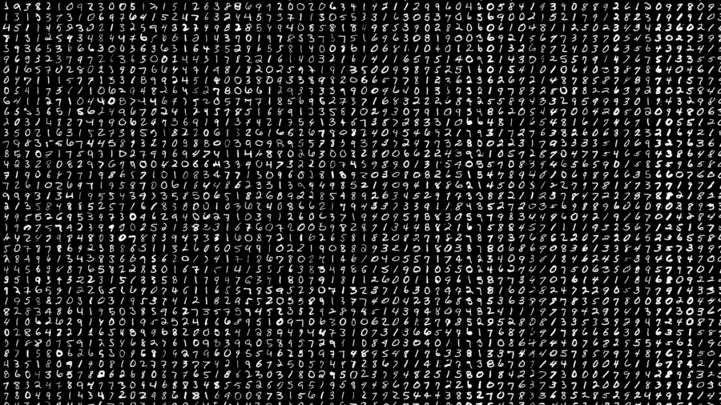
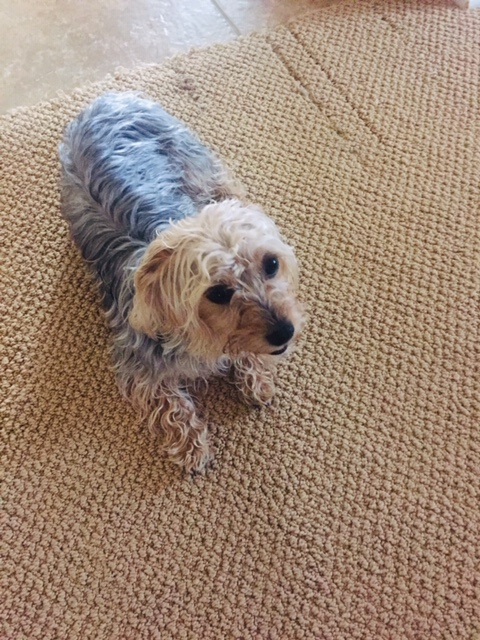
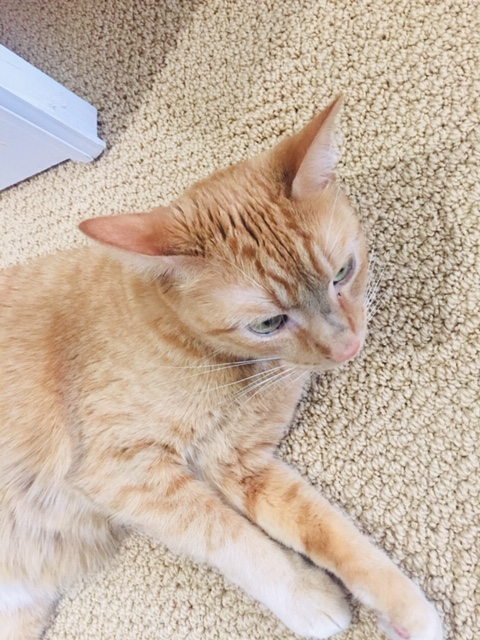

# MNIST

This is a trained network to distinguish written digets from 0 to 9 from any image. The notebook loads the model (99.17% accuracy) trained with the MNIST dataset. Scripts with the model and the training can be found. Three example images are provided to test the network, the images or not from the trainig set nor the testing set. To test it images have to be written on a black background with a white brush.

  

# Cats and Dogs

This is a trained network to distinguish between cats and dogs from any image. The notebook loads the model (85% accuracy) trained with the kaggle dataset. Scripts with the actual network and data pre-processing can also be found. Two example images are provided to test the network, the images or not from the trainig set nor the validation set.

  
  

# Visualization

The purpose of this scripts is to get an introduction into images and openCV to then visualize the process behind convolutional neural networks.

# Raspberry Pi  

The folder CDP consists of a bigger model with cats, dogs and persons. The network was optimized on a gpu with enough parameters so it has a consistent frame rate in a raspberry pi. The main purpose is to run camara.ipynb as a .py file in the raspberry with a webcam. The output is live video that classifies the given input into the categories. (It was trained with persons doing actions such as applauding, writing, etc).  
